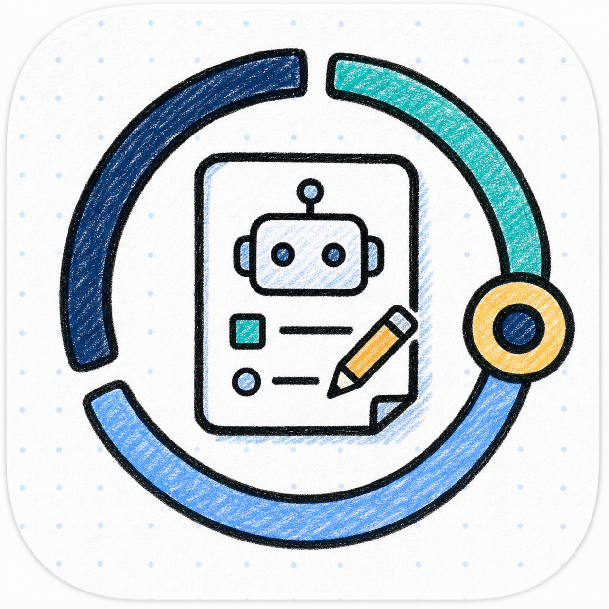
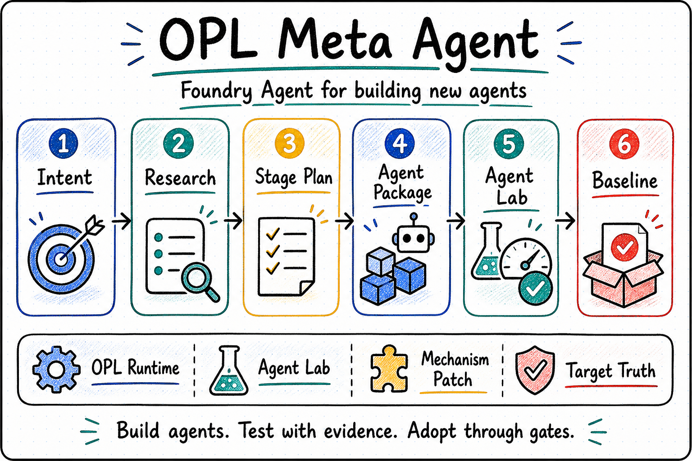
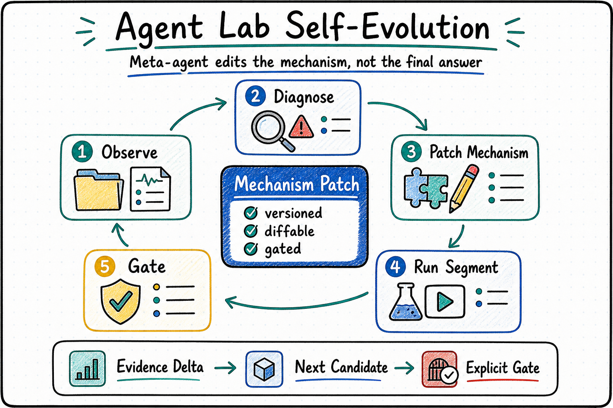

<p align="center">
  
</p>

<p align="center">
  <a href="./README.md">English</a> | <a href="./README.zh-CN.md"><strong>中文</strong></a>
</p>

<h1 align="center">OPL Meta Agent 元智能体工坊</h1>

<p align="center"><strong>用于开发、测试和持续优化新智能体的元智能体</strong></p>
<p align="center">智能体构建 · Agent Lab 测试 · 机制自进化</p>

<table>
  <tr>
    <td width="33%" valign="top">
      <strong>适用人群</strong><br/>
      想把高价值知识交付流程沉淀成可接入 OPL 的智能体的开发者、维护者和技术操作者
    </td>
    <td width="33%" valign="top">
      <strong>组织内容</strong><br/>
      用户意图、公开经验、阶段计划、智能体骨架、测试套件、交付回执和机制补丁建议
    </td>
    <td width="33%" valign="top">
      <strong>如何开始</strong><br/>
      说明目标智能体要交付什么、不能做什么、质量门槛是什么，系统会先生成可测试基线
    </td>
  </tr>
</table>

<p align="center">
  
</p>

> `OPL Meta Agent` 是一个独立的元智能体。它负责把“我要一个什么样的智能体”推进成可运行、可测试、可交付、可持续改进的智能体基线；OPL Framework 负责通用运行框架、Agent Lab、队列、回执、观测和采用门槛。

## 一句话快速启动

你可以直接这样说：

- “帮我把这个高价值知识交付流程做成一个可接入 OPL 的智能体，先明确交付物、边界和质量门槛。”
- “基于这个已有智能体仓库接管测试，生成 Agent Lab 测试套件、接管回执和自进化候选，但不要接管它的领域事实。”
- “跑一轮 Agent Lab 之后，把失败证据整理成机制补丁建议，等显式门槛通过后再采用。”

## 适合处理的工作

- 把新智能体想法拆成目标理解、经验调研、阶段计划、智能体骨架、测试套件、基线运行、交付和后续学习。
- 生成可接入 OPL 的描述文件、阶段与动作信息、记忆与产物定位、质量门槛和拥有者回执。
- 为新智能体或已有外部智能体组织 Agent Lab 测试套件、恢复探针、评分引用和采用门槛。
- 产出基线交付回执、受门控的学习候选和机制补丁建议。
- 把 Agent Lab 的真实运行证据整理成可审阅、可回滚、需要门控采用的下一版机制候选。

## 工作方式

- 用户提供目标智能体的领域、交付物、质量门槛、禁止事项和运行约束。
- `OPL Meta Agent` 组织公开经验、拆解阶段，生成候选智能体包，并交给 OPL Agent Lab 跑测试。
- Agent Lab 返回只包含引用和结果摘要的测试结果；本仓把它整理成交付回执、学习候选和机制补丁建议。
- 任何机制变更、默认智能体切换、质量采用或真实交付权威，都必须经过显式门槛或目标领域拥有者确认。

## Agent Lab 自进化闭环

<p align="center">
  
</p>

自进化闭环的核心不是让智能体直接改写最终答案，而是把一次运行拆成可审计的机制优化对象：

- **观察证据**：读取运行片段、轨迹、失败记录和候选引用。
- **诊断瓶颈**：定位重复失败、预算浪费、校验缺口或阶段漂移。
- **编辑机制**：只提出下一版机制候选，可能覆盖提示词策略、技能策略、阶段策略、测试套件策略、接管审阅策略、候选生成策略或质量门槛策略。
- **门控采用**：机制补丁仍然只是建议；它不能写入目标智能体的领域事实、记忆正文、产物正文或质量裁决，也不能绕过显式采用门槛。

## 当前定位与边界

- `OPL Meta Agent` 面向“开发智能体的智能体”：它把目标智能体需求推进成可测试、可交付、可持续优化的基线包。
- `agent/` 是本仓真实 domain pack 入口：`knowledge/`、`prompts/`、`quality_gates/`、`skills/`、`stages/` 至少提供可解析、非空、无占位的 domain-owned 文件，`contracts/stage_control_plane.json` 的 `prompt_refs` 必须指向这些真实文件。
- 本仓复用 OPL Framework 的脚手架、Agent Lab、队列、状态投影和采用门槛，不在本仓重建通用运行框架。
- CLI、MCP、Skill、product-entry 和工具描述由 OPL Framework 根据本仓的 action / stage 合同统一生成；本仓不维护私有通用入口包装层。
- 生成接口可以调用本仓声明的 minimal authority functions 和 domain smoke action，但只能投影 refs、回执、blocker 与候选，不能写领域事实、记忆正文、产物正文、质量/导出裁决或无 gate 推广默认 agent。
- OPL Framework 持有通用运行时、Agent Lab、标准脚手架、队列、阶段尝试记录、提供者回执、观测、优化引用和采用门槛。
- 目标领域智能体继续持有自己的领域事实、质量裁决、产物权威、记忆正文和拥有者回执。
- 对第一步不是由 `OPL Meta Agent` 开发的智能体，本仓也可以接管测试编排和自进化候选生成；默认仍只产生测试套件、接管回执、受门控候选和机制补丁建议。
- 本仓不训练或部署模型权重，不绕过门槛切换默认智能体，也不写入目标智能体的记忆正文、产物正文、质量裁决或领域事实。

<details>
  <summary><strong>给技术操作者看的机制说明</strong></summary>

- 最小自举入口是 `npm run bootstrap:sample -- --output-dir <dir> --opl-bin <opl>`：生成 `sample-brief-agent`，调用 OPL 脚手架校验，生成 Agent Lab 外部测试套件，运行 `opl agent-lab run --suite`，再写入基线回执、后续学习候选和 `mechanism-patch-proposal.json`。
- 外部接管入口是 `npm run takeover:test -- --agent-dir <existing-agent-dir> --output-dir <dir> --opl-bin <opl>`：读取目标智能体的描述文件和合同，生成接管测试套件，运行 Agent Lab，再写入接管回执、受门控的自进化候选和 `takeover-mechanism-patch-proposal.json`。
- 统一接口入口是 `opl agents interfaces --repo-dir <this-repo> --json`：OPL 读取本仓标准合同并生成 CLI、MCP、Skill、product-entry、OpenAI tool 和 AI SDK 描述。
- 机制补丁建议会记录 `mechanism_ref/version`、`editable_surfaces`、`observe/diagnose/edit`、`segment_run_ref`、`evidence_delta_ref`、`next_mechanism_candidate_ref` 和权限边界标记。
- OPL Agent Lab 的机制面是只读引用控制面。它可以暴露 `opl agent-lab mechanism --json` 和 `opl agent-lab evolve --suite <suite.json> --json`，但不能把测试通过、机制候选或演化片段升级成领域裁决。

</details>

## 这个仓库应该怎么读

1. 潜在使用者和智能体开发者先看当前首页，再继续看 [项目概览](./docs/project.md) 和 [当前状态](./docs/status.md)。
2. 技术规划、架构判断和边界同步，继续读 [架构](./docs/architecture.md)、[不可变约束](./docs/invariants.md) 和 [关键决策](./docs/decisions.md)。
3. 机器可读面在 [`contracts/`](./contracts/)；可执行验证入口在 [`scripts/`](./scripts/)；测试入口是 `npm test`。

## 给智能体和技术操作者的快速入口

<details>
  <summary><strong>如果你准备把这个仓直接交给 Codex 或其他智能体，先看这里</strong></summary>

- 先读本 README、[项目概览](./docs/project.md)、[当前状态](./docs/status.md)、[架构](./docs/architecture.md)、[不可变约束](./docs/invariants.md) 和 [关键决策](./docs/decisions.md)。
- 修改 contracts、README、docs 或 smoke scripts 时，同步更新 `tests/*.test.mjs`，确保边界标记仍然证明本仓只产出建议和引用，不直接采用或写入目标领域内容。
- 本仓只负责智能体构建语义、测试编排和自进化候选组织。需要真实运行、长线测试、机制读模型或演化片段时，调用 OPL Agent Lab。
- 不要把 `mechanism_patch_proposal` 当作已采用机制；它只是可进入门槛审查的候选。
- 不要把测试接管理解成接管目标智能体的领域事实、记忆正文、产物权威或质量裁决。

</details>

## 常用命令

```bash
npm test
```

验证内容包括合同字段、OPL 生成接口 bundle、`agent/` domain pack 文件存在性、`stage_control_plane.prompt_refs` 真实路径、非空文件与占位符检查。

```bash
npm run bootstrap:sample -- --output-dir /tmp/opl-meta-agent-demo --opl-bin /Users/gaofeng/workspace/one-person-lab/bin/opl
```

```bash
npm run takeover:test -- --agent-dir /tmp/opl-meta-agent-demo/sample-brief-agent --output-dir /tmp/opl-meta-agent-takeover --opl-bin /Users/gaofeng/workspace/one-person-lab/bin/opl
```

```bash
/Users/gaofeng/workspace/one-person-lab/bin/opl agents interfaces --repo-dir . --json
```

## 延伸阅读

- [Project](./docs/project.md)
- [Status](./docs/status.md)
- [Architecture](./docs/architecture.md)
- [Invariants](./docs/invariants.md)
- [Decisions](./docs/decisions.md)
- [Contracts](./contracts/)
